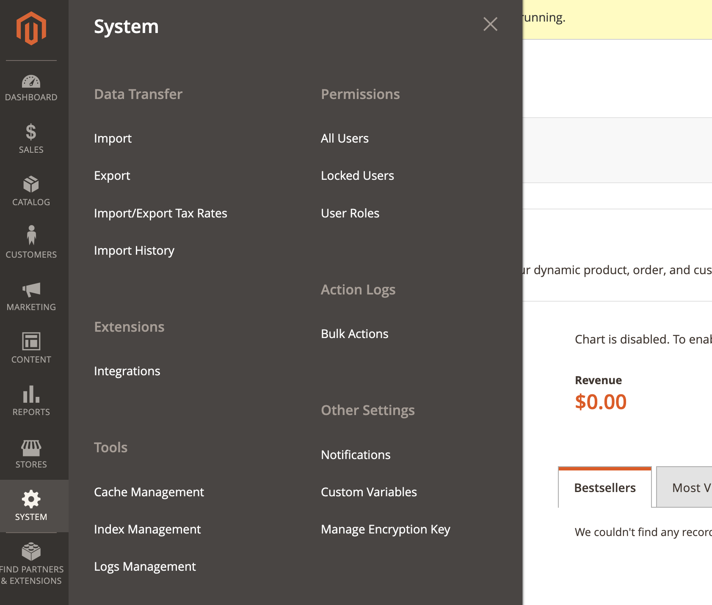

# Logs Management Magento2/Adobe Commerce module

Module gives opportunity to view logs files via admin interface. There's cron job which archive log files by cron as well.
Cron schedule can be configured via admin interface.


# Install

The package could be installed with composer:

```shell
composer require jentry/module-logs-management
```

# Config

Please proceed to Stores -> Configuration -> Advanced -> Logs Management

There are 2 tabs:
    - General
    - Cron Configuration

# View logs

Please proceed to System -> Tools -> Logs Management



There is grid with all log files in the /var/log folder. You can view separate file if you'll proceed to
view file page
